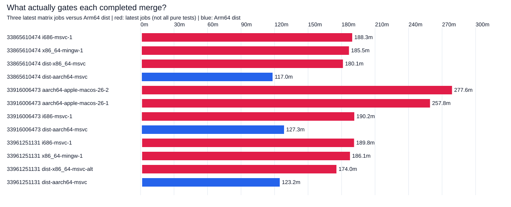
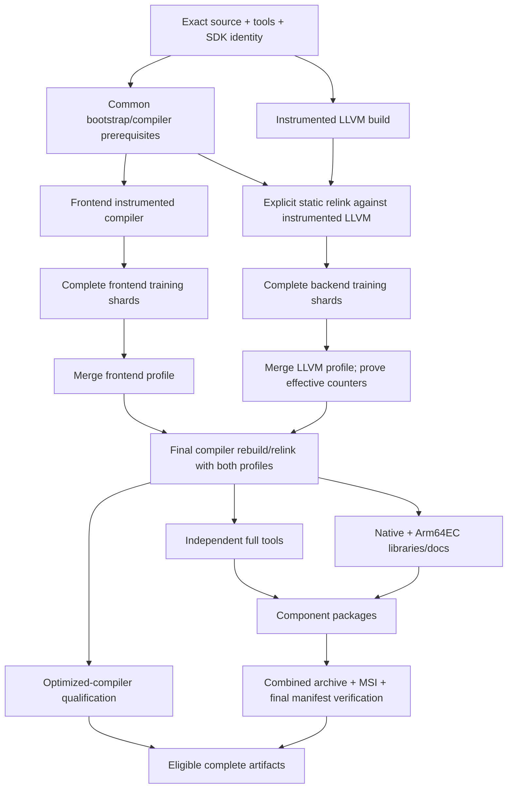

# Prioritized compiler-production options

Read the [completed-log baseline and visuals](README.md) first. Times below
refer to producing Rust, **not** to downstream IronRDP compilation.
This investigation does not change Rust/LLVM implementation code or upstream CI.

**Current decision:** [balanced proposal](BALANCED-PROPOSAL.md) combines the
completed 141.82-minute cold baseline with verified native Windows Arm64
16/32-vCPU hardware/pricing, nonlinear scaling, billed SUM and qualification/
retry costs. Prefer one native 32-vCPU job; retain a two-job profile/final-build
fallback before a broader DAG. Funding does not limit the choice. Earlier
rankings below address stock four-CPU jobs or the original hypothetical budgets.
The [annual capacity follow-up](ANNUAL-CAPACITY.md) distinguishes one runner per
build from a one-runner fleet: observed MSVC dist demand annualizes to ~4,224
attempts, exceeding one runner's central full-attempt capacity. Prefer simple
overflow/replacement capacity over adding a profile DAG solely for throughput.

## Updated priority when adding PGO and ThinLTO

The original stock-only savings below are small compared with the possible cost
of **adding** optimization stages. The new [offline projection](PGO-LTO-PROJECTION.md)
retains all distribution outputs and explicitly budgets fresh profile generation:
**~250–260 /405–415 /670–680 minutes** under efficient/planning/stress assumptions,
not measured Arm64 bounds. No full feasibility run was awaited.

| Priority for the optimized pipeline | Impact / evidence | Tradeoff / correctness gate |
|---|---|---|
| 1. Limit ThinLTO to final shipping artifacts initially | Avoids repeatedly paying potentially dominant LTO costs. Same-x64 initial instrumentation grew~101→287min; **not an Arm64 multiplier**. | Early-stage LTO changes can affect profile compatibility/quality; validate function hashes and effective counters. Never skip required static relinks. |
| 2. Reuse exact instrumented-LLVM artifacts when legitimate | Conditional planning case with10min restore and warm ordinary seed becomes~338–346min instead of~405–415. **No hit rate or restore time measured.** | Exact source/toolchain/SDK/flags/paths identity; fresh profiles and static relinks retained. Never confuse stock100% cache hits with this new cache entry. |
| 3. Evaluate minimal subsets before committing to the bundle | Representative modeled efficient/planning/stress: frontend PGO only~155/210/285min; ThinLTO only~140/195/295min; dual PGO without ThinLTO~235/370/590min. | Budgets are hypothetical; performance benefit is not proportional to subset size. Keep all targets/tools/docs/Arm64EC/packages and qualification. |
| 4. Overlap instrumented LLVM build with frontend work | Native four-job DAG saves~16/22/40min, adds~48/72/104 runner-min. Three persistent jobs with mid-job handoff save~24/38/65min but add~62/111/179 runner-min. | A job-level `needs` cannot start half a job early. Preserve frontend→static relink→LLVM training; rebuilding/linking needs more than a ready binary. Charge actual handoffs and waiting. |
| 5. Independent profile producers; avoid intermediate frontend profile-use build where correct | Modeled savings~29/62/115min; **adds~47/66/94 runner-min**. | Separate plain frontend against instrumented LLVM costs more work and may train slower. Both profiles must validate before final rebuild; not dual instrumentation. |
| 6. Split final compiler consumer from producers; later fan out eligible qualification/tools/docs | Planning final consumer has~248–254min compiler allowance within a350min job, with the modeled full tail retained. True fan-out may reduce additional wall time. | Splitting sequential jobs alone avoids timeouts, not elapsed work. Final compiler/packaging/installation gates remain; transfer and duplicate prerequisites can erase gains. |
| 7. Smaller setup/compression/shard changes | Retain the earlier0–2min setup and0–8min packaging screening targets. Possible optimized-tool compilation benefit is only~2–5min at assumed10–20% rates. | No automatic deduction from full dist time. Prove compiler lineage; do not transfer IronRDP percentages to compiler production. |

**Critical limit result:** the planning serial case needs its final compiler
phase to fit **~36–44min** to stay within360min; the assumed90min final does not.
The stress pre-final/retained budgets already exceed360. The correct response is
a qualified staged pipeline or a smaller optimization subset—not omitting work
or pretending profile reuse is fresh production.

The completed x64 profile-use treatment36973674727 took225.78min compiler time
using the control's existing profiles. It informs final-stage risk, **not** an
end-to-end production policy. The240min promotion timeout is a separate process
that publishes existing artifacts and does not recompile Rust.

See [revised dependency DAG and projected timelines](PGO-LTO-PROJECTION.md#4-correct-dependencies-and-genuine-parallelism)
and [machine-readable assumptions/results](pgo-lto-results.json). The previous
“Arm-only improvements save zero merge minutes” applies to shortening the old
job; **adding hours can make Arm the new critical path**, modeled explicitly.

## Decision: optimize two different clocks

1. **Arm64 artifact availability:** optimize its 117–127-minute, warm-cache,
   un-PGO'd distribution job and separately design a viable fresh-PGO pipeline.
2. **A complete qualified merge/release candidate:** optimize the actual last
   jobs, not merely the Arm64 job. Release publication adds an independently
   scheduled promotion process whose elapsed time is currently unknown.

The measured job graph has no serial edge from Arm64 dist to other platforms'
test jobs. [Counterfactual critical-path calculations](critical-path-models.json)
use **actual job finish timestamps**, retaining all other jobs unchanged:

| Assumed change — modeled, not a measured treatment | Sep 4 AM matrix saving | Sep 4 PM | Sep 5 |
|---|---:|---:|---:|
| Arm64 dist 20 min faster | 0 | 0 | 0 |
| All three Windows Arm64 jobs 20 min faster | 0 | 0 | 0 |
| i686-msvc-1 alone 30 min faster | 2.90 min | 0 | 3.67 min |
| Every MSVC/Mingw job 15 min faster | 15 min | 0 | 15 min |
| Both macOS 26 test jobs 90 min faster | 0 | 87.50 min | 0 |

The last row is a ceiling illustration, **not** an estimate that such a change
has been achieved. Queueing, runner concurrency and transfer changes could
reduce any modeled gain.

### The largest observed bottlenecks

* **Ordinary merge path:** `i686-msvc-1` takes 188–190 min. Sep 4 AM's main build
  contains 56.6 min compiler artifacts, 38.2 min tools, 63.5 min explicit tests,
  and 14.8 min LLVM/LLD. `x86_64-mingw-1` finishes only 2.9 min behind it;
  fixing just the first job immediately exposes the second.
* **Outlier merge path:** macOS 26 Arm64 shard 2 takes 277.6 min, of which
  **157.5 min** is observed LLVM/LLD intervals. Its C++ cache hit rate is
  **61.12%** (1,344 C++ misses), compared with the Windows Arm64 dist's 100%.
  MacOS shard 1 also takes 257.8 min. This is a cache/runner/build investigation,
  not evidence that the tests themselves suddenly became 120 min slower.
* **Windows Arm64 qualification:** shard 1 takes 137–140 min versus shard 2's
  105–113 min. Sep 4 AM explicit tests occupy 49.6 versus 27.6 min; each job
  independently spends roughly 30–32 min on compiler artifacts.
* **Arm64 dist:** tools 23–27 min + package/MSI 25–26 min + docs 9–11 min
  exceed stage1/stage2 compiler artifacts' 21–23 min. Packaging is a genuine
  serial tail: Sep 4 AM `rust-dev` ~4.98 min, combined archive ~5.65 min, and
  explicit MSI link ~5.32 min. The preceding ungrouped WiX preparation is
  left unresolved, not counted as compilation.

## Easy wins first

Ranges are **screening targets modeled from observed component budgets**, not
confidence intervals or promises. A range beginning at zero includes a negative
net outcome once overheads are measured. No cold Arm64 fresh-PGO speedup can be
estimated reliably from these warm un-PGO'd upstream observations.

| Order | Option / expected impact | Evidence and confidence | Cost / qualification |
|---|---|---|---|
| 1 | **Preserve correct compiler-cache hits / record cache identity per stage.** Approximately **0 min** for the already-100%-hit Arm64 C++ baseline; potentially tens of minutes on genuinely cold critical-path jobs. | High confidence in observed cache disparity, low in any proposed remedy's time. The cache misses may be legitimate source/config changes, not a cache bug. Do not conflate cache hits with downloaded LLVM or a clean compilation. | Exact keys include source/LLVM SHA, host clang, SDK, target set, optimization/instrumentation mode and profile digest. Wrong-key reuse risks invalid code. Prewarming may move cost off-path rather than remove runner-minutes. Do not share instrumented and final objects. |
| 2 | **Trim or overlap repeated setup**, not output/test coverage. Target **0–2 min/job**: second environment dump alone is ~1–1.5 min; citool build ~1 min. | Medium confidence in budget, unmeasured implementation. Cache the locked citool binary by source/compiler/platform; retain required diagnostics once and redact credentials. | Tiny cache compared with LLVM; restore/upload can erase benefit. Source-bound builds cannot start before source exists. Keeping scheduled work within a job avoids another runner's startup cost. |
| 3 | **Faster CI compression / concurrent independent package compression.** Screening target **0–8 min Arm64 dist**, bounded by 25–26 min explicit packaging. | Medium opportunity, low measured confidence. Existing profile is already `balanced`; don't assume maximum compression is currently in use. Promotion is configured to recompress XZ, so measure **combined CI + promotion** impact. | Preserve every component, MSI, package manifest, payload and final compression policy. More threads on 4CPU/16GiB may contend with linking; larger CI archives increase transfer/storage. Benchmark actual rust-dev/docs/compiler payloads, not zero-filled or source-only data. |
| 4 | **Rebalance existing Arm64 test shards**, retaining test/bootstrap coverage. Target **0–10 min for Arm64 qualification**, **0 global merge min in these samples**. | Current 22-min test-only imbalance suggests ideal ~11-min benefit if equal transferable suites, but compiler/tool prerequisites differ. | Could be a small Makefile/job-matrix change. Preserve x.py shebang and x.ps1 testing, every suite, and stage2 qualification. Measure suite durations and per-shard duplicated prerequisites before moving them. |
| Rejected probe | **Replace shallow Git with archive-only source acquisition. No demonstrated gain.** Measured archive minus Git is **+3.30s mean** (slower), not the initially screened 0–5-min opportunity. | Two opposite-order standard-runner probes: 180,584-file extraction/checkout dominates. Exact checkout equivalence remains unqualified because the strict raw-blob oracle rejected both controls and archives. Current upstream already uses `-j16`. | No production patch recommended. Source caching/pre-staging would be a different unmeasured option; archive fetch alone does not remove filesystem writes. Preserve gitlink identity, attributes, symlinks and nested modules before considering it again. |

**Recommended first upstream-sized step:** expose per-stage cache/CPU/disk
metrics and gate the full recursive `du . | sort ...` inventory behind a
diagnostic/failure path, while retaining cheap capacity/environment/tool identity
information and checking total setup time. The pinned
[`dump-environment.sh`](sources/rust-src_ci_scripts_dump-environment.sh) performs
that full directory walk both before and after submodule checkout; the second invocation
takes 59–90 seconds on the Arm64 samples. This bounds the opportunity, not a
measurement of `du` alone. The source
archive probe did **not** justify an acquisition patch. Next measure compression
on existing real distribution payloads. Do not start with a broad stage2 DAG rewrite,
drop LLVM targets/tools, or reduce training corpus/test qualification.

## Deeper pipeline parallelization: highest Arm64 opportunities

| Priority | Change | Modeled wall-clock opportunity | Runner/storage tradeoff and safety gate |
|---|---|---|---|
| A | **Fan out independent tools/docs/component packages after their compiler prerequisites**, then join for MSI/combined archive. | Screening target **10–25 min** from 23–27 min tools + 9–11 min docs; transfer and duplicate prerequisites may reduce this to zero. Not a claim that all tools start at time zero. | Usually 2–4 consumer runners, higher aggregate runner-minutes; each needs the exact compiler/sysroot/native dependencies. Duplicate compiler crates inside tools and archive transfer may dominate. Preserve rustdoc JSON/native + Arm64EC docs, cargo, clippy, rustfmt, Miri, analyzer, llvm-tools, dev artifacts and MSI. |
| B | **Overlapping profile-generation branches for a future effective-PGO Arm64 pipeline.** | Potentially the larger of the short serial branch budgets; **no calibrated Arm64 numeric saving yet**. Formula below; x64 timings are not substituted for Arm64. | Separate working trees, common source/toolchain identity, profile provenance and final rebuild barrier. More LLVM/front-end builds may erase the critical-path gain. Static LLVM requires real relinks on both instrumentation and final-use transitions. |
| C | **Shard training corpus/modes without removing any workload.** | For a measured training duration `T`, ideal N-way gain is `T - max(T_i) - transfer/merge/startup`; often less than `T(1-1/N)`. Existing stock Arm64 dist has **T=0**. | Ship exactly the same instrumented binary; isolated profile filenames/roots; merge the complete multiset with intended weights, not normalized per-shard averages. Require nonzero AArch64/InstCombine coverage, matching function hashes and unchanged downstream performance. |
| D | **Build shared test prerequisites once; shard test execution.** | Arm64 test-only ceiling near 11 min by balancing two shards, or more with additional shards, minus dependency/transfer overhead. Global Windows-shard improvements must cover the MSVC **and** Mingw frontier. | Avoid paying ~30-min compiler-artifact work twice if transferable, but stage2 test config is not necessarily the dist config. Do not simply substitute the release compiler for bootstrap/host-script coverage. Another producer job can worsen makespan while reducing CPU duplication. |
| E | **Defer non-training LLVM utilities until final distribution; consider non-LTO early instrumentation stages.** | Only relevant to a proposed PGO/ThinLTO build. Arm64 minutes **unknown**; local resumed 10m12s and pruned final 23m33s are not a treatment comparison. | Never delete shipped llvm-tools or disable target backends. Required generators/profdata/FileCheck remain. Linux already disables initial LLVM LTO on its shared-library path; static Windows has a different dependency/relink model. Validate profile function matching and downstream PGO quality when changing training code shape. |

### Proposed dependency graph

The backend branch can start LLVM compilation early, but cannot run training
until a working frontend has been **linked to that instrumented LLVM**. A profile-
optimized frontend is an existing throughput optimization, not necessarily a
semantic requirement for LLVM profile generation; using an earlier frontend
changes training time and must be evaluated. Dual-instrumenting one binary is
not assumed safe/equivalent and is not proposed as an easy win.

For baseline serial profile stages `F + B + R`, ideal parallel time is
`max(F, B') + R + X`, where `B'` includes any extra bootstrap/relink work and `X`
is artifact transfer/queue/merge overhead. Net gain is
`F + B - max(F, B') - X`; it may be negative. The final profile-use compiler
rebuild and its qualification **cannot** move ahead of the profiles.

Portable toolchain/profile artifacts are preferable to blindly copying a whole
CMake/Cargo build tree. Those trees embed absolute source/build/SDK paths,
timestamps and configuration fingerprints; importing them at a different
runner path can rebuild everything or silently mix variants. Record bytes,
compress/upload/download/extract times and hashes before accepting any DAG plan.

### Splitting a job is not automatically parallelism

`instrument -> train -> final` as three sequential jobs evades a per-job timeout
but adds transfers and startup; it is **not a wall-clock optimization**. Reusing
a profile from a previous job/run shortens the treatment's critical path but
does not eliminate the fresh training cost. Report these separately:

* cold complete production from source;
* warm compiler-cache production;
* fresh profile generation;
* exact-profile reuse and the profile's originating cost;
* artifact-ready versus all qualification complete versus published release.

The parent x64 example makes the distinction concrete: completed PGO control
opt-dist is **317m20s**, with instrumented rustc/LLVM **101m05s**, frontend
training **32m28s**, frontend rebuild **15m35s**, instrumented LLVM **78m47s**,
backend training **20m29s**, and final build **68m53s**. The concurrent ThinLTO
job timed out at 350 minutes, after an initial **287m14s** stage and frontend
training; it is not a successful production baseline. These timings are
**4CPU x64 compiler-only**, not an estimate for Arm64 hosted distribution.
Source markers and classifications are in [local-evidence.json](data/local-evidence.json).

## Qualification before promoting any option

1. Freeze Rust/LLVM/rustc-perf commits, clang/SDK, targets, outputs, profile
   provenance, cache keys and runner image. Match cold/warm states deliberately.
2. Check final compiler/LLVM/profile identities, effective counters, function
   hash mismatch warnings, AArch64 backend and optimization coverage.
3. Preserve stock dist's native + Arm64EC libraries/docs, full tools, LLVM
   utilities, dev archives, profiler, MSI and complete manifests.
4. Run relevant compiler/stdlib/tool suites and optimized-compiler tests;
   install every component through the normal distribution path. A compiler-only
   smoke test or IronRDP A/B pass is not release qualification.
5. Repeat retained downstream PGO performance controls; “same corpus” alone
   does not establish equal optimization quality after changing instrumentation.
6. Measure complete end-to-end wall time **and** runner-minutes, disk/memory
   high-water marks, artifact transfer overhead and retry rate. Report any
   profile reuse or prewarming as cost moved, not cost removed.

## Bounded experiment record

[Run 36992548740](https://github.com/marcpems/IronRDP-ci-benchmark/actions/runs/36992548740)
completed on two standard `windows-11-arm` runners, opposite Git/archive orders and a
35-minute per-job cap. It fetches only the exact LLVM commit from September
sample 33865610474 (`76a3a9d0075fe0df4bb57160372700006e3d0b2b`), not the
Rust 1.94.1 feasibility agent's LLVM commit.

No compiler build, global SDK edits, cancellation of another run, release writes,
or upstream mutations. Checkout credentials are not persisted; public downloads
run with an allowlisted environment. Artifact logs contain tool versions,
timings and file/blob verification, not environment dumps. Only this isolated
branch's workflow was launched. See the [complete measured outcome](SOURCE-PROBE.md):

* Git acquisition **250.82/260.42s**, archive **257.87/259.96s**.
* Archive is **3.30s slower on average**; no useful saving established.
* Strict literal-blob guards failed **both** methods; Git attributes and archive
  substitutions make that oracle insufficient for Windows checkout equivalence.
  This is not evidence of download corruption and not a qualified production patch.
* Results persisted; no extra full-build runner launched to pursue a no-gain candidate.

## Final ranking by expected impact and remaining blockers

1. **For an Arm64 artifact deadline:** tools/docs/package fan-out has the largest
   *observed eligible budget*: **10–25 min screening target**, medium opportunity,
   low timing confidence until transfer/prerequisite costs are measured.
2. **Lower-change Arm64 work:** compression **0–8 min**, shard rebalancing
   **0–10 min qualification-only**, setup **0–2 min**; all modeled, not measured
   treatment wins. Gating recursive diagnostic filesystem walks is the smallest
   first patch; it must retain failure diagnostics rather than hiding problems.
3. **For the whole merge:** investigate both macOS 26 cache-heavy jobs and the
   combined MSVC/Mingw test frontier. Conditional replay ceilings are **87.5 min**
   for the outlier or **15 min** for a uniform Windows improvement; neither is an
   achieved nor guaranteed speedup. Arm64-only changes save **0** in these samples.
4. **For future fresh Arm64 PGO:** independent profile branches/training shards
   may offer larger gains. [Conditional stage-budget projections](PGO-LTO-PROJECTION.md)
   are now available, but **actual minutes remain uncalibrated** pending a valid,
   complete, hosted fresh-profile distribution baseline. Keep static-LLVM relinks
   and final profile-use rebuild barriers; preserve all corpus/modes/coverage.
5. **Do not pursue archive-only acquisition now:** the bounded experiment showed
   no meaningful benefit and did not qualify equivalence. Do not count profile
   reuse, omitted tools/targets/tests, or timeout-only job splits as saved work.

Outstanding: private promotion timings/deployed-state confirmation; complete
Arm64 fresh-PGO full-distribution timings and qualification from the separate
feasibility investigation; real artifact transfer and compression measurements.
The separate agent was notified before/after the bounded source probe. The
[baseline job in 36991902911](https://github.com/marcpems/IronRDP-ci-benchmark/actions/runs/36991902911/job/110789801580)
subsequently completed successfully in **141.82 minutes**, including a
132.44-minute full-dist command. Its enclosing workflow is red from the earlier
treatment setup failure, not a failed baseline build. The
[initial setup attempt 36991037745](https://github.com/marcpems/IronRDP-ci-benchmark/actions/runs/36991037745)
was **completed/failure** and is excluded from production timing baselines.
No run was cancelled, rerun or duplicated by this investigation.

The [updated immutable feasibility report](https://github.com/marcpems/IronRDP-ci-benchmark/blob/95eb8b6f792e7851c8e4be7b47edacd5aa21c32b/arm-feasibility/FEASIBILITY.md)
documents the cold baseline and the same 360-minute CI / 240-minute promotion
limits. The corrected optimized treatment is not awaited, and no optimized
Arm64 full-build or upstream-readiness claim is made. The
[balanced proposal](BALANCED-PROPOSAL.md) incorporates only the completed baseline.
