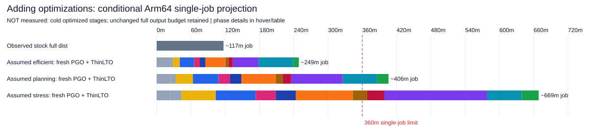
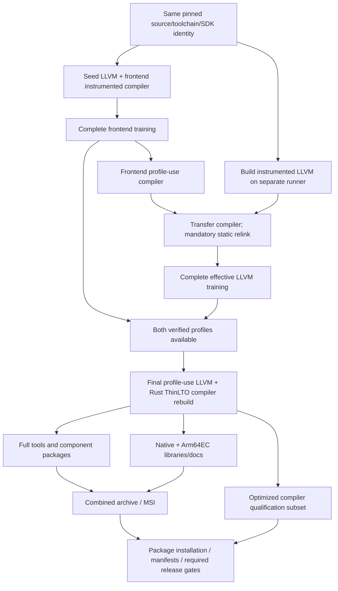
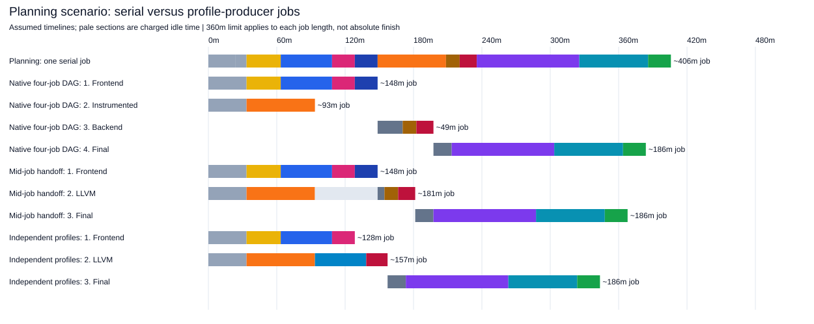

# What adding PGO + ThinLTO could cost Arm64 production

**October 2 follow-up: an offline planning model, not a new benchmark. No build
was launched, no feasibility result awaited, and no downstream performance
measurement was used as a compiler-production speedup.**

## Headline

Adding fresh frontend/LLVM PGO and final-stage Rust/LLVM ThinLTO can plausibly
turn the current **117–127-minute warm-cache full distribution** into a
**multi-hour production pipeline**. With the explicit component budgets below,
the efficient / central-planning / stress cases are approximately:

| Conditional scenario | Fresh PGO + final ThinLTO, full outputs | Added Arm job time / runner-minutes | One360-minute job? |
|---|---:|---:|---|
| Efficient | **~250–260 min (~4¼h)** | **~130 min** | Fits the assumed budget |
| Planning, not “most likely” | **~405–415 min (~7h)** | **~290 min** | **Does not fit** |
| Stress, not an upper bound | **~670–680 min (~11¼h)** | **~550 min** | **Does not fit** |

**These are scenarios, not confidence intervals or empirically bounded forecasts.**
There is no completed, matched, cold, effective-PGO+ThinLTO hosted Arm64
full-distribution baseline in this evidence. Some stage rates remain unknown.
The round budgets are engineering assumptions informed by component orders and
known failure modes, **not** local times multiplied by a CPU/core/ISA ratio.
Future measurements can replace each input without changing the model.



Colors: grey = retained setup/support; yellow = ordinary seed LLVM; blues =
frontend build/rebuild; pink/red = training; orange = instrumented LLVM; brown =
mandatory static relink; purple = final compiler; teal = retained distribution
work; green = added optimized-artifact qualification. Hover for phase values.
Only the stock row is a measured whole job.

## 1. Measured anchors, and what they cannot establish

| Evidence | Observation | Use / restriction |
|---|---|---|
| Upstream stock Arm64 runs33865610474 /33916006473 /33961251131 | Full jobs117.05 /127.30 /123.20min; cached LLVM/LLD~12min;100% C/C++ hits | Output/support budget and actual merge dependencies; **not cold optimized-stage rates** |
| Local Arm64 `optimized-pipeline-attempt-02.log` | Completed initial instrumentation59.73min; subsequent frontend training failed | Completed component, not successful production total or matched hosted cold build |
| Local resumed frontend portions | Valid frontend training9.58min; profile-use frontend rebuild7.83min | Component order only; the overall log's static-LLVM training was invalid |
| Corrected local Arm64 v2 | Instrumentation10.20min resumed; final23.55min with standalone utilities pruned | **Not** clean stage bounds or a complete release cost; never sum these into a valid total |
| Standard4CPU x64 control36946671654 | Fresh PGO/noThinLTO pipeline317.33min; initial101.09min; final68.88min; whole job~326min | Completed **compiler-only**, different architecture; low-confidence context |
| Standard4CPU x64 ThinLTO initial attempt | Initial stage287.23min; frontend training28.50min;350min timeout during rebuild | Completed-stage warning about early LTO; **no valid whole-pipeline duration** |
| Completed x64 treatment36973674727 | Reported total228m50s; profile-use build225.78min; **reused exact control profiles** | Final-stage context only, **not fresh production**, not full distribution |

All custom x64 runs used standard `windows-2025`,4CPU/16GB and unpruned LLVM
utilities. Local Arm64 used a Snapdragon X2 Elite,8 build jobs, a custom SDK/DIA
configuration and different retained build state. Upstream stock samples are
Rust1.100-era; custom observations are pinned1.94.1/LLVM21.1.8.
See [classified source markers](data/local-evidence.json) and
[new x64 handoff provenance/model inputs](pgo-lto-inputs.json).

**Do not conclude “ThinLTO is faster to produce” from228m50s versus326min.**
The shorter job did not generate fresh profiles. On the same x64 context,
the measured final compiler phase is about **3.28×** the control final phase.
The control final phase followed other builds in its tree; the treatment was
a separate job. **Identical profiles do not establish identical incremental/
bootstrap state**, so this ratio is not an isolated causal ThinLTO penalty.
Merely substituting225.78min for68.88min in the317.33min fresh control yields
**~474min (~7h54m), compiler-only**—a counterfactual, not a measured run.
Turning ThinLTO on in the earlier instrumented stage also increased that
completed stage from~101 to~287min (~2.84×). Neither ratio is applied as an
Arm64 hardware conversion.

## 2. Model: replace the compiler core, retain distribution work

For each observed Arm64 baseline:

```text
S = stock full-job time
C = stock compiler artifacts + cached LLVM/LLD
R = S - C  (retained stock outputs/support budget)

T_fresh = R + H + L0 + FI + FT + FU + LI + LR + LT + F + Q + E + U - D
added Arm job time = T_fresh - S
```

* `H`: extra collector/merge/provenance setup.
* `L0`: ordinary seed LLVM; **12min warm** in the efficient case,
  **30/60min assumed partial/cold budgets** in the other cases.
* `FI / FT / FU`: frontend instrumentation / complete fresh training /
  profile-use frontend rebuild to drive backend training.
* `LI / LR / LT`: instrumented LLVM / **mandatory static relink** /
  complete effective backend training.
* `F`: final LLVM profile-use ThinLTO plus every required Rust compiler
  bootstrap/rebuild/relink; **no earlier optimized-object reuse assumed**.
* `Q`: extra optimized-artifact qualification, not a replacement for ordinary CI.
* `E`: any additional newer-policy cargo/rustdoc/clippy-specific PGO work;
  **unknown**, not included in numerical cases (`E=0`).
* `U`: additional retained-tool linking/LTO or artifact-size costs if changed
  compiler flags affect those stages; **unknown**, set to zero in numerical
  cases. Unchanged output scope does not prove unchanged elapsed time.
* `D`: optional confirmed benefit when optimized compilers build retained tools;
  **zero in the headline cases**.

In representative run33865610474, `C=33.18min` and **`R=83.87min`**. The latter
retains **60.37min of full tools, docs, native+Arm64EC libraries and packaging**,
plus23.50min Actions/support/unresolved budget. Across the three runs,
`R=83.87–92.20min`. This avoids adding a complete optimized pipeline on top of
the original compiler core or mistakenly treating compiler-only logs as releases.

The retained prefix/tail in the diagrams is an **accounting placement**, not a
claim that every bootstrap support operation occurs at that precise position.
Retained libraries are distribution outputs; prerequisite bootstrap/sysroot work
needed inside optimized stages is charged to those stage budgets.
If global flags also add LTO to tools, charge that to `U` rather than silently
assuming the stock tail is still sufficient. Threshold headroom absorbs
`E + U - D`; positive unbudgeted costs make limit compliance harder.

### Explicit assumed minutes

| Added/replacement component | Efficient | Planning | Stress |
|---|---:|---:|---:|
| Ordinary seed LLVM `L0` | 12 | 30 | 60 |
| Frontend instrumentation `FI` | 25 | 45 | 70 |
| Frontend training `FT` | 10 | 20 | 35 |
| Frontend profile-use rebuild `FU` | 10 | 20 | 35 |
| LLVM instrumentation `LI` | 35 | 60 | 100 |
| Static relink/rebuild slice `LR` | 5 | 12 | 25 |
| Effective LLVM training `LT` | 8 | 15 | 30 |
| Final profile-use ThinLTO compiler `F` | 45 | 90 | 180 |
| Extra profile support `H` | 5 | 10 | 20 |
| Extra qualification `Q` | 10 | 20 | 30 |

These budgets are deliberately exposed rather than presented as measured Arm64
stages. In particular, **cold effective LLVM training and full-output ThinLTO
cannot be bounded from the resumed/pruned local evidence**. Even180min is not
an established upper bound for the final compiler. The new x64225.78min result
is a reason to retain an overflow sensitivity: **if** Arm64's final phase took
that long, the otherwise unchanged planning job would be~542min, **not** because
x64 proves that Arm64 will take225.78min.

The primary cases use **no ThinLTO on transient instrumentation binaries**.
This is a proposed configuration choice, not verified profile-quality
equivalence. If early-stage ThinLTO doubles `L0+FI`, the planning case rises
from~406 to~481min while holding everything else constant. A~2.84× early-stage
sensitivity gives~544min. Instrumented LLVM-stage inflation would add further
cost; those one-variable examples are not joint forecasts.

## 3. Subsets: smaller changes may fit without the full bundle

Representative baseline, rounded planning budgets:

| Configuration | Efficient / planning / stress job minutes | Interpretation |
|---|---|---|
| Frontend PGO only, no ThinLTO/LLVM PGO | **~155 /210 /285** | Keep stock cached LLVM; `FU` is the final frontend build, not an extra duplicated final stage |
| ThinLTO only, no fresh PGO | **~140 /195 /295** | Complete standalone LLVM+Rust bootstrap/core budget is independently assumed45/90/180min; equality with `F` is a scenario convenience, not measured |
| Fresh frontend+LLVM PGO, no ThinLTO | **~235 /370 /590** | Replace `F` with assumed30/55/100min; fresh backend work can still breach6h |
| Fresh frontend+LLVM PGO + final ThinLTO | **~250 /405 /670** | Full model above |
| Exact-profile-use-only consumer | **~140 /200 /305** | **Not fresh production**; excludes the producing jobs' profile-generation cost |

These subsets do **not** predict proportional fractions of the downstream
performance improvement. Each needs retained-quality/regression evaluation;
do not silently drop target coverage, LLVM utilities, tools, training corpus or
release qualification to meet a time budget.
LLVM-PGO-only and Rust-only versus LLVM-only ThinLTO remain additional candidates,
but the combined historical builds do not identify their individual costs.
An LLVM-only profile pipeline still needs a real trainer compiler/static link;
simply subtracting all frontend phases without replacing that prerequisite would
underestimate it. Use separate measured/assumed trainer and final-core inputs
rather than inventing an additive attribution of the combined LTO result.

The extra newer opt-dist tool-PGO policy is separate from retaining full tools:
all tool **outputs** remain in `R`, but instrumenting/training those tools would
add `E`. Preserve the chosen version's optimization policy explicitly.

### A genuinely warm optimized-stage cache is a different scenario

An **exact instrumented-LLVM artifact hit** could remove compilation work while
still generating fresh profiles. It requires matching LLVM revision, clang/SDK,
host/targets, instrumentation/LTO flags, paths and build configuration—not just
the stock uninstrumented LLVM key. Never restore old raw profile counters or
skip the compiler's mandatory static relink to the restored instrumented LLVM.
Frontend binaries have stricter Rust-revision dependencies; no such reuse is
assumed here.

As an explicit sensitivity, replacing the planning60min LLVM-instrument build
with **10min restore/identity/coverage validation** saves50min, leaving~356–364min:
**not all samples fit360**. If ordinary seed LLVM also retains its measured
~12min cache behavior instead of the assumed30min, the same scenario becomes
**~338–346min**, potentially within350. These are **conditional cache-hit
budgets**, not observed restore times or guaranteed hit rates. Final profile-use
LLVM still rebuilds against the new profile; profile reuse is not being hidden.
Unknown `E/U`, larger transfers or legitimate source/config changes can erase
the remaining margin.

## 4. Correct dependencies and genuine parallelism

The conservative first DAG improvement is **overlapping LLVM instrumentation
compilation**, not pretending LLVM training is independent of its compiler.



A deeper alternative builds an **uninstrumented frontend against instrumented
LLVM on an independent branch**. It does not dual-instrument that frontend.
Then frontend and backend profile generation can proceed independently,
and `FU` can be omitted if its only role was accelerating backend training:

```text
FE profile branch = seed LLVM + frontend instrumentation + frontend training
BE profile branch = instrumented LLVM + plain frontend/static link + backend training
final compiler begins only after BOTH profiles arrive and validate
```

This adds a separate plain-frontend build and may make backend training slower.
The model assumes plain-frontend costs25/45/70min and training slowdowns
0/25/50%; those values are **unmeasured**. The final profile-use compiler and
required static relinks are never skipped. Prove compatible function hashes,
nonzero backend counters/coverage and retained downstream performance before
calling either pipeline equivalent.



### What the job split buys—and costs

Planning case, representative baseline; compact artifact handoffs assumed6min
per critical transfer and final consumer setup10min:

| Layout | Arm path wall minutes | Summed Arm runner-min | Longest job |
|---|---:|---:|---:|
| One serial fresh-production job | **~405** | **~405** | **~405: exceeds360** |
| Native four-job DAG: frontend / LLVM-build / relink-training / final | **~385** | **~475** | **~185** |
| Three persistent jobs with explicit mid-job artifact handoff | **~370** | **~515** | **~185** |
| Independent profile producers, with the assumptions above | **~345** | **~470** | **~185** |

**Prefer ordinary job-level dependencies where possible.** The four-job design
starts frontend and instrumented-LLVM builders independently, then a relink/
training job `needs` both, then the final consumer. It saves approximately
**16/22/40min** across the scenarios and adds **48/72/104 runner-min**, under the
assumed extra setup and three critical handoffs.

The three-persistent-job variant is **not expressible by putting
`needs: frontend` on the whole LLVM job**—that would prevent the overlap. It needs an
explicit, bounded, authenticated artifact-ready handoff between concurrently
running jobs; its backend runner waits while reserved. It is included as a
comparison, not a claim that a normal job-level dependency permits mid-job starts.
Across efficient/planning/stress cases, this overlap saves approximately
**24/38/65min** of Arm path time but adds approximately **62/111/179 runner-min**.
The independent branch examples save approximately **29/62/115min**, while
adding **47/66/94 runner-min**. These are **modeled**, not executed.

Producer setup is duplicated; the conservative backend runner's wait for the
frontend is **charged** to runner-minutes. All modeled individual producer/
consumer jobs fit360min—even where the whole pipeline still takes~10h.
There is no6h whole-workflow limit implied by the hosted **per-job** limit.
Queueing/concurrency restrictions are not measured and can reduce these gains.

**Do not transfer whole CMake/Cargo trees and assume these handoff budgets.**
Use pinned compiler/sysroot/profile artifacts where valid, preserving paths,
native dependencies and provenance. Larger transfers,16GB memory pressure,
LLVM utility link costs or insufficient disk can invalidate these budgets.
**A ready static-linked compiler binary is not itself a relink input.** Supply
compatible backend/compiler objects and build metadata, or rebuild the required
compiler/backend from source. `LR` explicitly budgets that work, but5–25min is
not a verified upper bound. Such rebuild/transfer requirements are a reason to
consider the independent plain-frontend branch rather than assume cheap patching
of a shipped executable.

Final compiler/test/dist fan-out is a subsequent optimization: overlap the
compiler-test subset with eligible tools/docs work, then join before package
installation/manifest gates. Its ideal extra gain is bounded by the smaller
parallel branch, minus handoff/setup/duplication. The entire `Q` allowance is
**not automatically movable** before packaging; package-dependent checks remain
after package assembly. The earlier10–25min tools/docs fan-out screening target
is not stacked on top as a guaranteed additional saving.

## 5. Limits, thresholds and whole-merge impact

* **Rust CI360min = hosted6h per job.** Use350min operationally to reserve
  evidence/upload margin. Final compiler + distribution work is a real barrier.
* With planning pre-final stages fixed, the final compiler must finish in
  **~36–44min** across the three stock residual budgets to fit one360min job
  (**~26–34min** at350). The assumed90min final does not fit.
* In the stress case, the pre-final/retained/qualification budgets already
  exceed360: **no possible final-stage speedup alone makes one job fit**.
* With profile producers split out, a planning final compiler consumer retaining
  the whole distribution tail has **~248–254min for compiler work at a350min
  job budget**. If actual `F` exceeds that, also separate eligible dist/testing
  work or optimize the final build; moving profile generation alone is not enough.
* **Promotion's240min timeout is unrelated to these compiler-job totals.**
  Promotion still consumes previously built CI artifacts. Artifact-size changes
  could affect recompression/upload, but those timings remain unknown.
  Missing a scheduled promotion selection could also delay publication by a
  scheduling interval; that conditional calendar effect is not measured here.
* **Ordinary test CI is not automatically rebuilt with the optimized compiler.**
  Its sampled jobs remain unchanged unless explicitly reconfigured. Added
  optimized-artifact qualification is separately budgeted as `Q`.

The previous “speeding up Arm64 saves zero whole-merge minutes” conclusion does
not mean adding hours to Arm64 is free. Holding other jobs/start offsets fixed:

| Original merge | Old makespan | Added makespan, efficient / planning / stress fresh serial |
|---|---:|---:|
| Sep4 AM,33865610474 | ~190min | **~60 /220 /480min** |
| Sep4 PM,33916006473 | ~279min | **~0 /135 /400min** |
| Sep5,33961251131 | ~192min | **~65 /220 /485min** |

This replays the actual other-job frontier and final workflow suffix. It is
not a scheduling forecast for a busier runner pool. Full per-run arithmetic
and both parallel layouts are in [generated tables](PGO-LTO-TABLES.md).

## 6. Could faster compilation of tools repay some production cost?

Possibly, but not the entire added cost. Observed stage2 tool-building intervals
sum to **18.6–23.0min**. If—and only if—the compiler building those tools is the
qualified optimized compiler, an assumed **10–20%** reduction saves roughly
**2–5min**, versus~130/~290/~550min added in the fresh serial cases.

No IronRDP percentage is transplanted to these tool builds. Documentation,
packaging, source checkout and all remaining time are **not** discounted.
Compiler lineage and actual timings must establish any benefit; headline
projections conservatively deduct **zero**.

## Revised priority for adding optimizations

1. **Avoid applying expensive ThinLTO indiscriminately to transient stages.**
   Start with a final-only policy, subject to profile/function-hash qualification.
   This has much greater production-time leverage than shaving a minute of setup.
2. **Preserve safe reuse of immutable instrumentation inputs**, especially LLVM
   when its exact identity is unchanged; regenerate the profiles and force the
   required relinks. Distinguish this from reusing old profiles or final PGO
   objects. Defer utilities not needed for training until the final build only
   if every shipped utility is still built and qualified.
3. **Evaluate minimal subsets deliberately:** frontend PGO only, final ThinLTO
   only, and PGO without ThinLTO. Their performance benefits are unknown fractions
   of the combined bundle; preserve every output and required qualification.
4. **Overlap instrumented LLVM compilation with frontend work**, then consider
   genuinely independent profile producers and removal of the intermediate
   frontend profile-use rebuild where correct.
5. **Preserve the final compiler barrier and design consumer handoffs to fit
   job limits.** Test/tools/docs fan-out can help after that barrier; all gates
   must join before release eligibility.
6. **Count fresh training and profile identity explicitly.** Exact-profile reuse
   is useful for a controlled A/B but is not an assumed release production policy.
7. **Only then optimize smaller unchanged costs**—diagnostic directory walks,
   compression, setup and ordinary test-shard balance. They cannot rescue an
   over-budget final compiler by themselves.

Reproduction is offline: `python project_pgo_lto.py`. Inputs:
[`pgo-lto-inputs.json`](pgo-lto-inputs.json); complete output:
[`pgo-lto-results.json`](pgo-lto-results.json). The separate feasibility study
remains the owner of measured full-distribution validation; this estimate does
not wait on it or claim upstream readiness.
