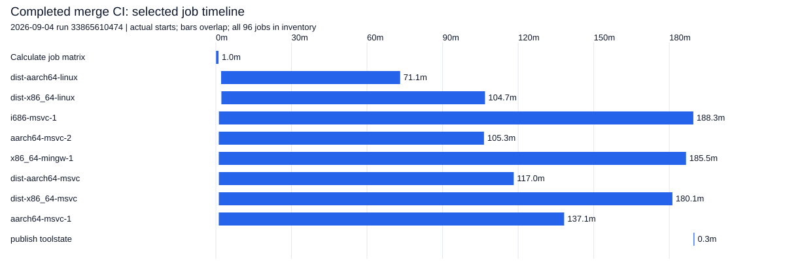
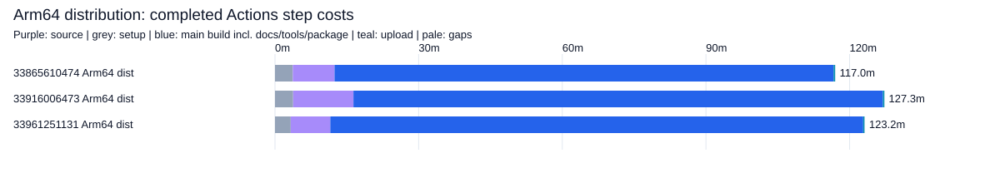
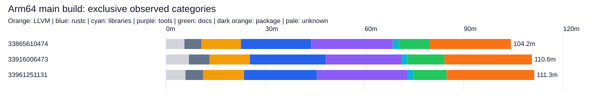
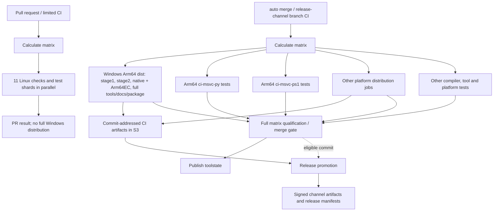

# Rust compiler production time — completed-log baseline

**Scope: producing and qualifying Rust toolchains, not compiling IronRDP.**
Analysis dated 2026-10-02. Sources are completed successful September 4–5 CI
runs, not October master and not the separate Rust 1.94.1 experiments.

## First conclusions

* **Windows Arm64 distribution takes 117–127 minutes**, including full tools,
  Arm64EC standard library/docs, archives and MSI; the main build is 104–111 min.
* **These are warm compiler-cache builds:** all three Arm64 logs report **100%
  C/C++ cache hits** and 97.7–97.9% total cache-hit rates. They are not cold
  LLVM compilation baselines. The hosted machines report 4 cores and ~16 GiB RAM.
* **Arm64 is not the whole merge workflow's critical path.** The last matrix
  jobs are i686 MSVC testing (~188–190 min), or macOS 26 Arm64 testing (~278 min).
  Speeding only Arm64 dist by 20 minutes would have saved **zero** whole-merge
  minutes in these samples; it would deliver that platform's artifacts earlier.
* **Tools and packaging, not just rustc, dominate Arm64 dist:** together they
  account for **49–54 min** of the main step. Stock Arm64 dist does **not** run
  opt-dist PGO training. Adding PGO is a different production pipeline.

## Observed runs and accounting

| Completed run | Kind/date UTC | Jobs | Whole workflow minutes | Sum runner-minutes | Last matrix job |
|---|---|---:|---:|---:|---|
| [33865610474](https://github.com/rust-lang/rust/actions/runs/33865610474) | Merge, Sep 4 AM | 96 | 189.95 | 9,419.73 | i686-msvc-1 |
| [33916006473](https://github.com/rust-lang/rust/actions/runs/33916006473) | Merge, Sep 4 PM | 95 | 279.25 | 9,866.72 | aarch64-apple-macos-26-2 |
| [33961251131](https://github.com/rust-lang/rust/actions/runs/33961251131) | Merge, Sep 5 | 96 | 191.57 | 9,030.77 | i686-msvc-1 |
| [33866567178](https://github.com/rust-lang/rust/actions/runs/33866567178) | PR, Sep 4 | 13 | 84.78 | 592.83 | x86_64-gnu-miri |
| [33999184885](https://github.com/rust-lang/rust/actions/runs/33999184885) | PR, Sep 5 | 13 | 77.08 | 484.17 | x86_64-gnu-gcc |

Makespan is run start to last completed job, including matrix/queue gaps;
`updated_at` is **not** used as a proxy for end. Runner-minutes sum API job
elapsed times, not CPU, billed minutes, or exclusive critical-path time.
Independent matrix jobs overlap. The final toolstate job depends on the
matrix. Two PR runs are context, not same-commit matched controls.



## What is inside Arm64 distribution?



| Minutes | Sep 4 AM | Sep 4 PM | Sep 5 |
|---|---:|---:|---:|
| Entire dist job | 117.05 | 127.30 | 123.20 |
| Root source checkout | 1.25 | 1.67 | 1.15 |
| Submodule checkout | 7.47 | 10.93 | 7.12 |
| Main build (includes below) | 104.22 | 110.57 | 111.28 |
| Upload to S3 | 0.30 | 0.30 | 0.28 |



| Inside main build, exclusive elapsed minutes | Sep 4 AM | Sep 4 PM | Sep 5 |
|---|---:|---:|---:|
| LLVM/LLD: cache retrieval, build/link/install | 11.94 | 12.11 | 12.30 |
| Stage1 + stage2 compiler artifacts | 21.24 | 22.99 | 22.07 |
| Native + Arm64EC libraries | 1.75 | 1.63 | 1.90 |
| Tools, including rustdoc binaries and installer helpers | 24.71 | 23.04 | 27.29 |
| Docs plus documentation generators | 9.27 | 11.24 | 10.01 |
| Explicit package/MSI intervals | 24.64 | 26.38 | 26.49 |
| Bootstrap/support, vendoring, copyright | 5.13 | 6.30 | 5.39 |
| **Unresolved build intervals** | **5.53** | **6.88** | **5.84** |
| PGO training | Not configured | Not configured | Not configured |
| In-job compiler qualification test suite | Not configured | Not configured | Not configured |

The last two rows do not imply qualification is omitted: separate Arm64 test
jobs run alongside dist. Do not add their durations to the dist job. Unresolved
time includes ungrouped orchestration/installer work; it is **not** assigned to
pure compilation. Tiny dry-run groups, explicit resumed groups and nested
opt-dist timers are retained with timestamps and source log line numbers.
The interval sweep prevents double-counting.

Full evidence:

* [Every job, start/end, runner label, conclusion and Actions step](ALL-JOBS-AND-STEPS.md).
* [Bootstrap intervals and opt-dist training/final-build/test timers](BOOTSTRAP-INTERVALS.md).
* [Machine-readable aggregate, intervals and cache facts](summary.json).
* [`data/`](data): run/step API snapshots and filtered log markers with raw-log SHA256.
* [`sources/`](sources), indexed by [`data/sources.json`](data/sources.json):
  exact source snapshots. The September merge observations use distinct Rust
  commits; see each run JSON, rather than assuming the Rust 1.94.1 pin.

## CI versus release: dependencies, not a second compiler rebuild



`dist-aarch64-msvc` executes `python x.py dist bootstrap --include-default-paths`,
with `DIST_REQUIRE_ALL_TOOLS=1`, native host, native + Arm64EC targets and profiler
support. Arm64 tests explicitly split `make ci-msvc-py` and `make ci-msvc-ps1`.
The dist job does not depend on those test shards; the all-platform gate does.
Release promotion and exact current trigger/qualification details are being
verified separately; no public promotion elapsed-time sample is included here.
**Do not add a speculative promotion cost, or assume it recompiles rustc.**

## Evidence exclusions

* Local Snapdragon X2 Elite compiler-only logs use 8 jobs, custom SDK/DIA and
  utility choices; resumed pieces are component evidence only.
* `optimized-pipeline.log`'s 1h49m41s reused an instrumented compiler and had
  ineffective static-LLVM training: not a valid optimized production total.
* The 59m43s initial instrumentation, corrected 10m12s resumed instrumentation,
  and 23m33s final build **must not be summed** into a clean release estimate.
* Parent x64 ThinLTO's 350-minute timeout produced no valid optimized artifact;
  its fresh-profile control and profile-reusing replacement are separate cohorts.
* Downstream 16–19% compilation savings do not measure compiler production.
* Linux/x64 values are different hardware, caches and optimization policies;
  no cross-platform normalized speedup is inferred.

## Reproduce

No third-party Python dependencies. `GH_EXE` may override the local `gh` path.

```powershell
python .\ci-benchmark\build-time\collect.py --logs
python .\ci-benchmark\build-time\collect.py --runs 33866567178 33999184885
python .\ci-benchmark\build-time\analyze.py
```

The analyzer is offline once evidence is collected; it asserts timing accounting
and validates SVG XML. Full raw public logs stay untracked under `raw/`.
The upcoming prioritized options and bounded source-fetch experiment will
distinguish measured savings from modeled opportunities and unchanged outputs.
