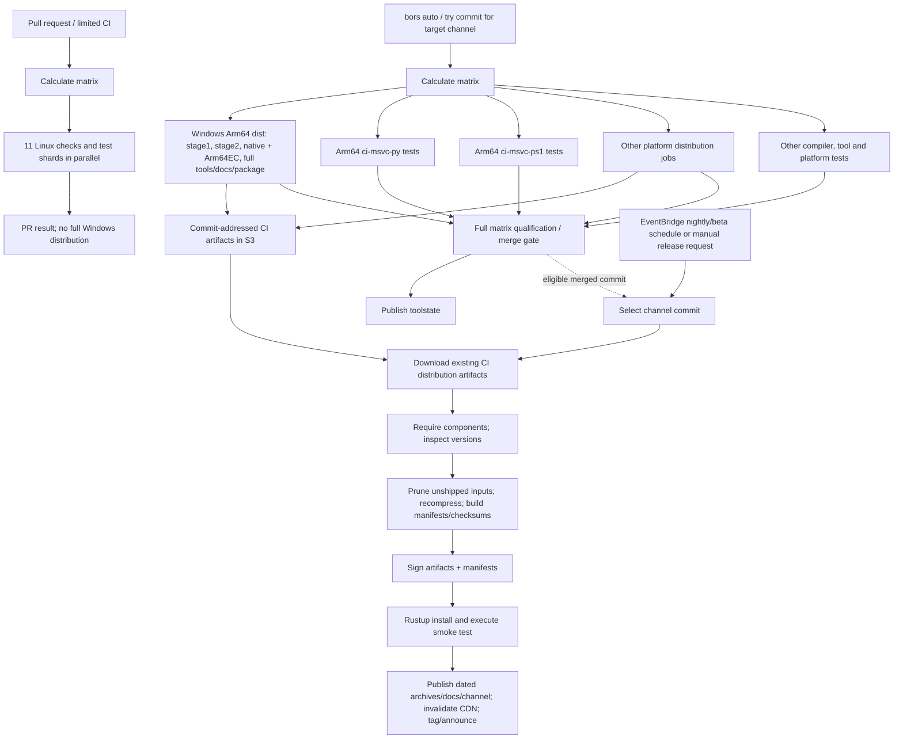

# Rust compiler production time — completed-log baseline

**Scope: producing and qualifying Rust toolchains, not compiling IronRDP.**
Analysis dated 2026-10-02. Sources are completed successful September 4–5 CI
runs, not October master and not the separate Rust 1.94.1 experiments.
Next: **[prioritized easy wins, critical-path models and deeper pipeline options](OPTIONS.md)**.
The [completed two-runner source probe](SOURCE-PROBE.md) found **no useful
archive-only fetch saving** and did not qualify checkout equivalence.

## First conclusions

* **Windows Arm64 distribution takes 117–127 minutes**, including full tools,
  Arm64EC standard library/docs, archives and MSI; the main build is 104–111 min.
* **These are warm compiler-cache builds:** all three Arm64 logs report **100%
  C/C++ cache hits** and 97.7–97.9% total cache-hit rates. They are not cold
  LLVM compilation baselines. The hosted machines report 4 cores and ~16 GiB RAM.
* **Arm64 is not the whole merge workflow's critical path.** The last matrix
  jobs are i686 MSVC testing (~188–190 min), or macOS 26 Arm64 testing (~278 min).
  Speeding only Arm64 dist by 20 minutes would have saved **zero** whole-merge
  minutes in these samples; it would deliver that platform's artifacts earlier.
* **Tools and packaging, not just rustc, dominate Arm64 dist:** together they
  account for **49–54 min** of the main step. Stock Arm64 dist does **not** run
  opt-dist PGO training. Adding PGO is a different production pipeline.

## Observed runs and accounting

| Completed run | Kind/date UTC | Jobs | Whole workflow minutes | Sum runner-minutes | Last matrix job |
|---|---|---:|---:|---:|---|
| [33865610474](https://github.com/rust-lang/rust/actions/runs/33865610474) | Merge, Sep 4 AM | 96 | 189.95 | 9,419.73 | i686-msvc-1 |
| [33916006473](https://github.com/rust-lang/rust/actions/runs/33916006473) | Merge, Sep 4 PM | 95 | 279.25 | 9,866.72 | aarch64-apple-macos-26-2 |
| [33961251131](https://github.com/rust-lang/rust/actions/runs/33961251131) | Merge, Sep 5 | 96 | 191.57 | 9,030.77 | i686-msvc-1 |
| [33866567178](https://github.com/rust-lang/rust/actions/runs/33866567178) | PR, Sep 4 | 13 | 84.78 | 592.83 | x86_64-gnu-miri |
| [33999184885](https://github.com/rust-lang/rust/actions/runs/33999184885) | PR, Sep 5 | 13 | 77.08 | 484.17 | x86_64-gnu-gcc |

Makespan is run start to last completed job, including matrix/queue gaps;
`updated_at` is **not** used as a proxy for end. Runner-minutes sum API job
elapsed times, not CPU, billed minutes, or exclusive critical-path time.
Independent matrix jobs overlap. The final toolstate job depends on the
matrix. Two PR runs are context, not same-commit matched controls.
The merge ranges are also descriptive, **not matched A/B estimates**: source
commits, some optimization policies and some Linux runner classes differ.
Cache/physical-hardware state remains **unknown** for jobs without focused
raw-log evidence; runner labels alone do not prove equal machines.


## What is inside Arm64 distribution?


| Minutes | Sep 4 AM | Sep 4 PM | Sep 5 |
|---|---:|---:|---:|
| Entire dist job | 117.05 | 127.30 | 123.20 |
| Root source checkout | 1.25 | 1.67 | 1.15 |
| Submodule checkout | 7.47 | 10.93 | 7.12 |
| Main build (includes below) | 104.22 | 110.57 | 111.28 |
| Upload to S3 | 0.30 | 0.30 | 0.28 |


| Inside main build, exclusive elapsed minutes | Sep 4 AM | Sep 4 PM | Sep 5 |
|---|---:|---:|---:|
| LLVM/LLD: cache retrieval, build/link/install | 11.94 | 12.11 | 12.30 |
| Stage1 + stage2 compiler artifacts | 21.24 | 22.99 | 22.07 |
| Native + Arm64EC libraries | 1.75 | 1.63 | 1.90 |
| Tools, including rustdoc binaries and installer helpers | 24.71 | 23.04 | 27.29 |
| Docs plus documentation generators | 9.27 | 11.24 | 10.01 |
| Explicit package/MSI intervals | 24.64 | 26.38 | 26.49 |
| Bootstrap/support, vendoring, copyright | 5.13 | 6.30 | 5.39 |
| **Unresolved build intervals** | **5.53** | **6.88** | **5.84** |
| PGO training | Not configured | Not configured | Not configured |
| In-job compiler qualification test suite | Not configured | Not configured | Not configured |

The last two rows do not imply qualification is omitted: separate Arm64 test
jobs run alongside dist. Do not add their durations to the dist job. Unresolved
time includes ungrouped orchestration/installer work; it is **not** assigned to
pure compilation. Tiny dry-run groups, explicit resumed groups and nested
opt-dist timers are retained with timestamps and source log line numbers.
The interval sweep prevents double-counting.

The Sep 4 AM Arm64 log identifies clang-cl **20.1.3**, MSVC tools
**14.44.35207**, image **20260830.155.1**, source-built LLVM configured for all
listed supported codegen backends, and Rust **1.100.0-nightly**. Do not transfer
its times to the pinned 1.94.1/LLVM21.1.8 experiment merely because host clang
matches. Exact commands, image IDs and compiler identifications are in the
per-job `log_facts`.

### Other important jobs and optimization stages

| Elapsed job minutes | Sep 4 AM | Sep 4 PM | Sep 5 |
|---|---:|---:|---:|
| Windows Arm64 test shard 1 | 137.10 | 140.08 | 137.47 |
| Windows Arm64 test shard 2 | 105.28 | 109.45 | 113.00 |
| Windows x64 dist (8CPU/32GB label) | 180.07 | 181.02 | 149.33 |
| Linux Arm64 dist | 71.07 | **94.12, different runner** | 70.95 |
| Linux x64 dist | 104.65 | **174.13, different runner** | 103.87 |

Sep 4 AM/Sep 5 Linux hosts are EC2 c9g.4xlarge/c8a.4xlarge respectively;
Sep 4 PM uses an 8-core hosted Arm64 label and a 36-core CodeBuild x64 label.
Exclude that middle observation from a hardware-matched Linux aggregate.

| Windows x64 opt-dist leaf timer, minutes | Sep 4 AM | Sep 4 PM | Sep 5 |
|---|---:|---:|---:|
| Initial instrumented compiler/tools + LLVM | 49.03 | 46.79 | 40.46 |
| Frontend profile gathering | 13.92 | 14.28 | 12.11 |
| Rustdoc profile gathering | 2.01 | 2.01 | 1.82 |
| Clippy profile gathering | 2.85 | Not configured | 2.49 |
| Profile-use frontend rebuild | 21.18 | 17.71 | 16.44 |
| Instrumented LLVM build | 9.10 | 13.17 | 7.36 |
| Backend profile gathering | 7.21 | 7.22 | 5.84 |
| Final dist build/tools/docs/package | 51.70 | 55.35 | 43.41 |
| Optimized-artifact test invocation | 11.12 | 11.49 | 9.27 |

These are actual **nominal production stage timings**, not proof of effective
PGO. We have not independently verified the upstream x64 backend counters;
static-link instrumentation/relink correctness is a separate prerequisite.
The middle sample's policy differs; do not pool these as identical treatments.
Small stage setup gaps, building opt-dist/rustc-perf and Actions setup sit outside
these leaf timers and remain visible in the full inventory.

Full evidence:

* [Every job, start/end, runner label, conclusion and Actions step](ALL-JOBS-AND-STEPS.md).
* [Bootstrap intervals and opt-dist training/final-build/test timers](BOOTSTRAP-INTERVALS.md).
* [Machine-readable aggregate, intervals and cache facts](summary.json).
* [`data/`](data): run/step API snapshots and filtered log markers with raw-log SHA256.
* [`sources/`](sources), indexed by [`data/sources.json`](data/sources.json):
  exact source snapshots. The September merge observations use distinct Rust
  commits; see each run JSON, rather than assuming the Rust 1.94.1 pin.

## CI versus release: dependencies, not a second compiler rebuild



`dist-aarch64-msvc` executes `python x.py dist bootstrap --include-default-paths`,
with `DIST_REQUIRE_ALL_TOOLS=1`, native host, native + Arm64EC targets and profiler
support. Arm64 tests explicitly split `make ci-msvc-py` and `make ci-msvc-ps1`.
The dist job does not depend on those test shards; the all-platform gate does.
`ci.yml` triggers on PRs and `automation/bors/{auto,try,try-perf}`, not directly
on every push to `stable`. Channel configuration selects the intended release.
For MSVC, `ci-msvc-py` runs stage2 tests skipping `compiler`/`src`, while
`ci-msvc-ps1` skips `tests`/`library`/`tidyselftest`; both skip linkchecker and
exercise distinct Windows bootstrap entrypoints. These are not interchangeable
with the optimized-artifact subset of tests in opt-dist.

### Promotion is a separate AWS process; its measured time is unknown

Pinned [`promote-release` source](https://github.com/rust-lang/promote-release/blob/f699a3c4abdf090f09afb062794e5f5b7fd34d9f/src/lib.rs)
downloads existing `rustc-builds/<commit>/` artifacts, validates required
components, recompresses, generates manifests/checksums, signs, smoke-tests
installation and execution, publishes artifacts/docs/channel metadata, invalidates
CDNs, and tags/announces. Even `build-manifest` is extracted as an already-built
binary from CI output. **It does not rebuild the compiler.**

The [pinned infrastructure definition](https://github.com/rust-lang/simpleinfra/blob/3db50ee298dd74635f3196cac3d4c3c72f4597af/terraform/releases/impl/promote-release.tf)
declares `promote-release--{dev,prod}` in AWS CodeBuild
(`BUILD_GENERAL1_XLARGE`, Linux container, **240-minute configured timeout**).
That is a limit, **not observed duration**, and is separate from GitHub's
360-minute hosted-job limit. The [channel configuration](https://github.com/rust-lang/simpleinfra/blob/3db50ee298dd74635f3196cac3d4c3c72f4597af/terraform/releases/environments.tf)
schedules nightly/beta at 00:00 UTC; stable has no automatic cron entry.
Authorized manual/Lambda entrypoints select channel/environment, including
dev-stable preparation and production publication. These are public source
definitions as inspected October 2, not a verification of deployed AWS state
on the September sample dates.

| Promotion operation / configured phase | Wall cost |
|---|---|
| Container/startup + load signing keys | **Unknown: no completed private CodeBuild log** |
| Select commit, acquire existing CI artifacts, component checks | **Unknown** |
| Recompression, checksum/manifest generation, signing | **Unknown** |
| Rustup installation/execution smoke tests | **Unknown** |
| Publish archives/docs/channel, CDN invalidation, announcements | **Unknown** |

The infrastructure routes execution logs to CloudWatch and blocks public access
to the release-log bucket. No private credentials/access were sought. Complete
publication-latency ranking therefore requires authorized completed promotion
logs; CI's artifact upload duration is not a substitute.

## Evidence exclusions

* Local Snapdragon X2 Elite compiler-only logs use 8 jobs, custom SDK/DIA and
  utility choices; resumed pieces are component evidence only.
  The earlier MSVC control log's 5 seconds is a no-op/resume; the LLD control
  log's 9m10s is incremental with prior LLVM state, not a clean control.
* `optimized-pipeline.log`'s 1h49m41s reused an instrumented compiler and had
  ineffective static-LLVM training: not a valid optimized production total.
* The 59m43s initial instrumentation, corrected 10m12s resumed instrumentation,
  and 23m33s final build **must not be summed** into a clean release estimate.
* Parent x64 ThinLTO's 350-minute timeout produced no valid optimized artifact;
  its fresh-profile control and profile-reusing replacement are separate cohorts.
* Downstream 16–19% compilation savings do not measure compiler production.
* Linux/x64 values are different hardware, caches and optimization policies;
  no cross-platform normalized speedup is inferred.

[Nine explicitly classified earlier local/x64 logs](data/local-evidence.json)
retain hashes and timing markers, including valid corrected profile evidence
versus invalid/resumed/time-out totals. They are not added to the upstream
timeline or used to manufacture a complete optimized Arm64 release duration.

## Reproduce

No third-party Python dependencies. `GH_EXE` may override the local `gh` path.

```powershell
python .\ci-benchmark\build-time\collect.py --logs
python .\ci-benchmark\build-time\collect.py --runs 33866567178 33999184885
python .\ci-benchmark\build-time\collect_sources.py
python .\ci-benchmark\build-time\analyze.py
```

The analyzer is offline once evidence is collected; it asserts timing accounting
and validates SVG XML. Full raw public logs stay untracked under `raw/`.
Validation: `python -m unittest discover -s .\ci-benchmark\build-time -p test_analyze.py`.
[`collect_local.py`](collect_local.py) is optional and requires the named earlier
local evidence paths. Hosted source-probe reproduction is isolated in
[`arm-build-time-source-probe.yml`](../../.github/workflows/arm-build-time-source-probe.yml).
The [options report](OPTIONS.md) separates measured, modeled and unknown effects.

**Investigation validation:** six focused tests pass; all 313 job totals
reconcile; four SVGs parse as XML; local links/source snapshots exist; generated
data, inventories and visuals reproduce byte-for-byte. The two source-probe
jobs completed with negative qualification results, preserved separately from
production baselines. No full compiler build or upstream CI configuration was
changed by this investigation.
